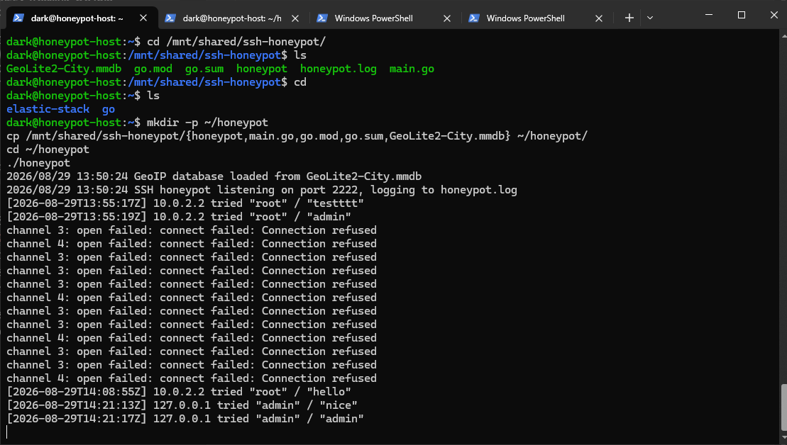
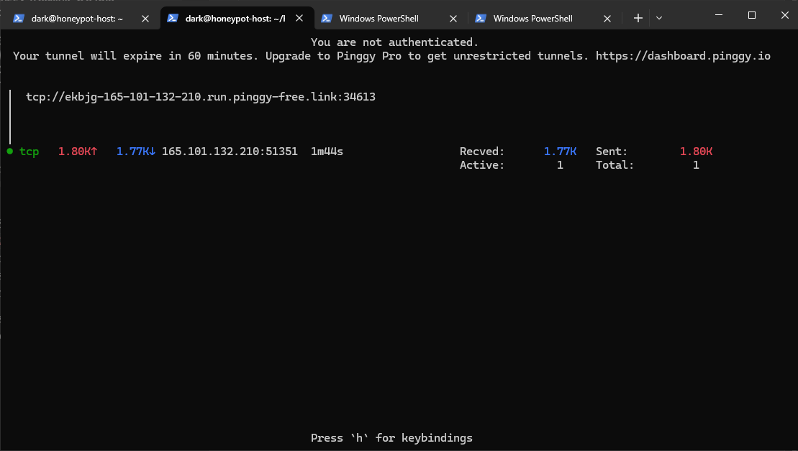
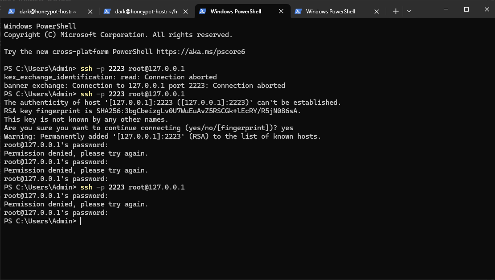
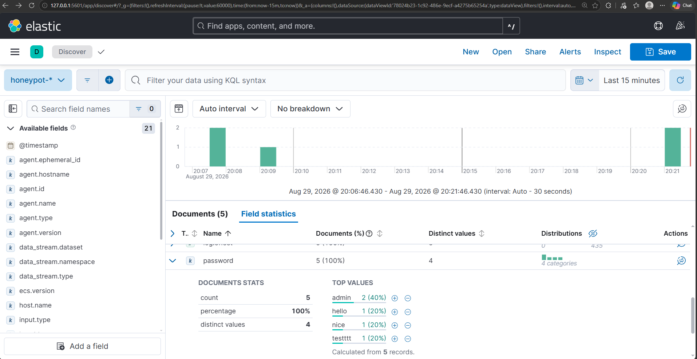

# SSH Honeypot with Elastic Stack Analytics

A custom SSH honeypot written in Go that logs every login attempt made against it — attacker IP, username, password, and GeoIP location — and ships that data into a full Elastic Stack (Elasticsearch + Kibana + Filebeat) pipeline for analysis. Exposed to the real internet via a reverse tunnel, not just simulated traffic.

Built as a learning project to pick up Go and get hands-on with honeypot-based threat intelligence, inspired by James Andrews' [Building an SSH Honeypot and analysing the results with Elastic Stack](https://jgandrews.com/posts/ssh-honeypot/).

## Architecture

```
Internet
   │
   ▼
Pinggy TCP tunnel (public endpoint, auto-reconnecting)
   │
   ▼
Go SSH Honeypot  ──▶  honeypot.log (JSON, GeoIP-enriched)
(always rejects auth)         │
                               ▼
                           Filebeat
                               │
                               ▼
                          Elasticsearch
                               │
                               ▼
                            Kibana
```

Everything runs inside a single Ubuntu Server 24.04 LTS VM (VirtualBox), which sits behind a home connection with CGNAT — so the honeypot isn't reachable via direct port forwarding. A [Pinggy](https://pinggy.io) reverse SSH tunnel solves that without needing a paid VPS or a credit card.

## Features

- **Fake SSH server** (Go, [`gliderlabs/ssh`](https://github.com/gliderlabs/ssh)) — accepts any username/password combination for the attempt, but the password handler always returns `false`, so no login ever actually succeeds
- **Structured JSON logging** — every attempt logged with timestamp, source IP, username, password
- **GeoIP enrichment** (MaxMind GeoLite2 via [`oschwald/geoip2-golang`](https://github.com/oschwald/geoip2-golang)) — country, city, latitude/longitude added per attempt when available
- **Real attacker IP preservation through the tunnel** (HAProxy PROXY protocol via [`pires/go-proxyproto`](https://github.com/pires/go-proxyproto)) — without this, every connection through a reverse tunnel would appear to originate from `127.0.0.1`, silently breaking GeoIP for all tunneled traffic
- **Full Elastic Stack pipeline** (Docker Compose) — Filebeat tails the log, ships to Elasticsearch, visualized in Kibana
- **Live on the real internet** via an auto-reconnecting Pinggy tunnel, not just local testing

## Tech stack

| Component | Choice |
|---|---|
| Honeypot | Go, `gliderlabs/ssh`, `oschwald/geoip2-golang`, `pires/go-proxyproto` |
| GeoIP data | MaxMind GeoLite2 City (free tier) |
| Log shipping | Filebeat 8.15.3 (`filestream` input + `ndjson` parser) |
| Storage & search | Elasticsearch 8.15.3 |
| Visualization | Kibana 8.15.3 |
| Orchestration | Docker Compose |
| Host | Ubuntu Server 24.04 LTS in VirtualBox |
| Public exposure | Pinggy (free-tier TCP tunnel) |

## Repository structure

```
.
├── elastic-stack/         # Docker Compose stack (ES + Kibana + Filebeat)
│   ├── docker-compose.yml
│   └── filebeat.yml
├── honeypot/              # Go source for the SSH honeypot
│   ├── main.go
│   ├── go.mod / go.sum
│   ├── GeoLite2-City.mmdb # see note below on redistributing this
│   └── run-tunnel.sh      # Auto-reconnecting Pinggy tunnel wrapper
├── img/                   # Proof-of-concept screenshots (see below)
└── README.md
```

## Demo

**Honeypot logging real login attempts (with GeoIP loaded):**


**Pinggy tunnel active, showing real external traffic stats:**


**Confirming the honeypot correctly rejects an external connection attempt:**


**Kibana Discover showing captured attempts with parsed fields:**


## Setup

### Prerequisites

- Go 1.22+
- Docker + Docker Compose
- A free [MaxMind](https://www.maxmind.com/en/geolite2/signup) account for the GeoLite2 City database (no card required)
- SSH client with a local keypair (`ssh-keygen`) — required for unattended Pinggy tunnels

### Running the honeypot

```bash
cd honeypot
go build -o honeypot .
./honeypot
```

Place `GeoLite2-City.mmdb` (downloaded from your MaxMind account) alongside the binary for GeoIP enrichment — it's optional; the honeypot runs fine without it and just skips geo fields.

Environment variables:
- `HONEYPOT_PORT` (default `2222`)
- `HONEYPOT_LOG_PATH` (default `honeypot.log`)
- `GEOIP_DB_PATH` (default `GeoLite2-City.mmdb`)

### Running the Elastic Stack

```bash
cd elastic-stack
docker compose up -d
```

Open `http://localhost:5601`, then **Stack Management → Data Views → Create data view**: pattern `honeypot-*`, timestamp field `timestamp`.

### Going live

```bash
cd honeypot
./run-tunnel.sh
```

Prints a public `tcp://<random>.pinggy-free.link:<port>` address that forwards straight to the honeypot. Free-tier Pinggy sessions expire after ~60 minutes; the script auto-reconnects. The tunnel runs in `tcp+x:haproxy` mode, which makes Pinggy prepend a PROXY protocol header carrying the real client IP — the honeypot's listener parses this transparently (see Issues below for why this matters).

## The build process

1. **Chose the project type**: an SSH honeypot, after learning about honeypots as a cybersecurity concept and wanting a hands-on portfolio project.
2. **Found a reference architecture**: James Andrews' blog post using Go + Elastic Stack, and decided to replicate it closely — partly to learn Go as a new language.
3. **Hosting research**: ruled out Oracle Cloud Free Tier and most "free VPS" options (require a card); Azure for Students didn't complete verification; ultimately discovered the home connection is behind **CGNAT**, ruling out direct port forwarding entirely.
4. **Landed on**: a local VirtualBox VM (Ubuntu Server 24.04 LTS) plus a reverse SSH tunnel (Pinggy) for public exposure — a genuinely free path that needed no card and no persistent public IP of its own.
5. **Built the Go honeypot**: `gliderlabs/ssh` server with a password handler that always rejects, structured JSON logging.
6. **Added GeoIP enrichment**: MaxMind GeoLite2, with graceful fallback if the database file isn't present.
7. **Built the Elastic Stack pipeline**: Docker Compose with Elasticsearch, Kibana, and Filebeat (`filestream` + `ndjson` parser — the modern equivalent of the older `log` input's `json.keys_under_root`, which the original blog post had issues with).
8. **Went live**: exposed the honeypot via an auto-reconnecting Pinggy tunnel and verified real external traffic reaching it and flowing through to Kibana.

## Issues encountered along the way

The issues I have faced along the way:

- **VirtualBox shared folder wouldn't mount** — the `vboxsf` kernel module hadn't built correctly during the Guest Additions install; fixed by installing `linux-headers` for the running kernel and re-running `/sbin/rcvboxadd setup`.
- **Missed the SSH setup step during Ubuntu install** — OpenSSH server wasn't installed; had to add it manually afterward (`apt install openssh-server`).
- **VirtualBox NAT blocks host→VM connections by default**, including for SSH management — needed explicit port-forwarding rules in VM settings, separate from any router-level config.
- **Elasticsearch got OOM-killed** shortly after starting — its Docker memory limit (1.5GB) was too tight against a 1GB JVM heap, leaving no room for JVM overhead. Fixed by raising the container limit to 2GB.
- **Kibana crash-looped (exit code 134 / SIGABRT)** for the same underlying reason — its memory limit (512MB) was well below what Kibana 8.x needs to even finish booting. Raised to 1.5GB.
- **Two VirtualBox port-forward rules collided** on the same host port (2222) after adding a rule to test the honeypot directly — broke SSH management access until reorganized onto separate host ports.
- **`vboxsf` (VirtualBox's shared folder filesystem) isn't reliable for a continuously-tailed log file** — moved the honeypot to run from the VM's native filesystem instead of the shared folder, keeping the shared folder purely for file transfer.
- **Docker silently created an empty directory** where the log file should have been, because the bind-mount source didn't exist yet at container-creation time — required a full `docker compose down && up -d` to force a clean recreate once the real file existed.
- **`docker compose logs filebeat` always showed nothing**, even while working correctly — Filebeat's official image logs to internal files by default, not stdout. Not a bug; just a quirk of that image.
- **Pinggy's free tier prompted for an SSH password** despite being a "no auth" tunnel service — a known quirk documented by Pinggy; entering any string works, but for an unattended auto-reconnect script the real fix is generating a local SSH keypair (`ssh-keygen`), which stops the prompt entirely.
- **Pinggy free-tier tunnels expire every ~60 minutes** — solved with a small bash wrapper that loops and reconnects automatically.
- **Reverse tunnels silently discard the real attacker IP by default** — a plain `ssh -R` tunnel relays each incoming connection as a *new local connection from the tunnel client itself*, so the honeypot logged every tunneled attempt as `127.0.0.1` — meaning zero real GeoIP data despite the honeypot being "live." Caught by noticing `127.0.0.1` entries in the log that should have been external. Fixed on both ends: enabled Pinggy's `tcp+x:haproxy` PROXY protocol mode, and added a PROXY-protocol-aware listener (`pires/go-proxyproto`) in the Go code to parse the real IP out of the header. Verified by simulating a PROXY-protocol-prefixed connection with a spoofed IP and confirming it resolved to the correct GeoIP location. **Any data collected before this fix has no real attacker geolocation.**

## Honest caveats

- Traffic arrives via a shared tunnel-provider IP rather than a dedicated public IP sitting still for weeks, so the volume and character of "organic internet noise" differs from the original blog's methodology — expect real attacker traffic, but likely lower volume than a persistent VPS would see.
- The fake shell is currently shallow (login-attempt logging only, no post-auth interaction) since the honeypot never grants a session.
- **GeoIP location reflects the connecting IP, not necessarily the attacker's real location.** Bots/attackers connecting through a VPN or proxy will resolve to that provider's exit server location instead — a fundamental limit of IP-based geolocation in general, not something fixable at the honeypot level. This likely skews results toward known hosting/VPN hubs (e.g. Netherlands, Germany, USA, Singapore) rather than attackers' true locations, though a meaningful share of real scanning traffic does genuinely originate from datacenters and compromised servers regardless.

## Possible future work

- Persistent hosting (a proper VPS) once available, for higher-volume, longer-running data collection
- Kibana dashboards summarizing top attacker countries, most-attempted credentials, and attack timing patterns
- Deeper fake-shell interaction to log post-connection behavior (though this honeypot only ever rejects auth, so this would be a design change)
- Correlating observed IPs against public threat-intel feeds (e.g. AbuseIPDB)
- ASN lookup (MaxMind GeoLite2-ASN) alongside city/country, to distinguish residential-ISP traffic from datacenter/hosting/VPN traffic even where the specific person can't be identified

## Credits

Architecture inspired by [James Andrews' SSH honeypot + Elastic Stack post](https://jgandrews.com/posts/ssh-honeypot/).

## License

MIT